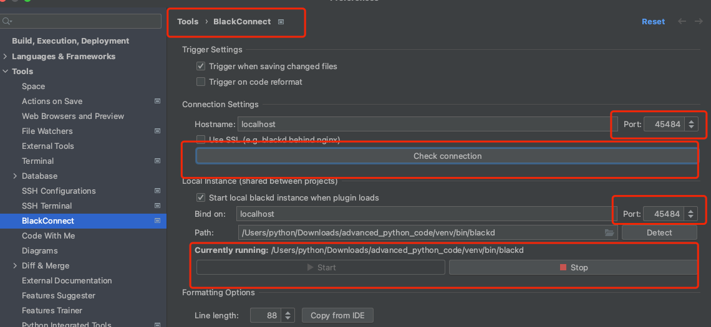

# ***Python高级编程***
**Python3.9.2：代码Env环境为mac**
 
---

## 推荐IDE: mac Pycharm
快捷键
- ctrl+h: 查看 Hierarchy 子类

## 前置配置
- blackd 格式化代码配置

## 第一章：一切皆对象

1. [函数和类都是对象](chapter01_all_is_obj/01_all_is_object.py)
2. [object 是所有类的基类,type是一个类，同时type也是一个基类](chapter01_all_is_obj/02_type_object_class.py)
3. [对象三个特征:身份，类型，值](chapter01_all_is_obj/03_category.md)
---

## 第二章：魔法方法
1. [通过__getitem__实现对象切片](chapter02_magic_method/01_magic_method.py)
2. [数据模型-->查看len()调用顺序：首先调用__len__函数，再调用__getitem__](chapter02_magic_method/02_data_model.py)
3. [魔法方法分类:**数学运算**和**非数学运算**-->熟悉len()的魔法方法__str__](chapter02_magic_method/03_magic_methods_list.py)
4. [类实例化时__init__与__enter__，__exit__和__del__调用顺序,以及with的对应魔法方法糖](chapter02_magic_method/04__init__n__enter__sequence.py)
---
## 第三章：面向对象编程
1.  [鸭子类型](chapter03_Class/01_duck_category.py)
2.  [抽象基类abc.ABCMeta和抽象方法abc.abstractmethod](chapter03_Class/02_abc/01_ABCMeta.md)
3.  [类型判断isinstance,*type配合is*与*==*使用](chapter03_Class/03_isinstance_type.py)
4.  [类变量与实例属性](chapter03_Class/04_class_object_params.py)
5.  [对象变量的查找顺序__mro__](chapter03_Class/05_class_object_attr_search_sequence.py)
6.  [静态方法@staticmethod-->类方法@classmethod、实例方法](chapter03_Class/06_class_quiet_object_method.py)
7.  [数据封装和私有属性变形](chapter03_Class/07_private_method.py)
8.  [对象的自省机制:类和对象的__dict__属性](chapter03_Class/08_self_ex.py)
9.  [父类调用查找机制super:涉及mro的算法](chapter03_Class/09_super.py)
10. [多继承及mixin编程模式](chapter03_Class/10_DRF_mixin.md)
11. [上下文管理器协议with:简化try_except_finaly和对象初始化和销毁](chapter03_Class/11_with.py)
12. [@contextlib.contextmanager修饰生成器:省略了 __enter__() / __exit__() 的编写](chapter03_Class/12_contextlib.py)
13. [eval()动态调用函数和方法](chapter03_Class/13_dynamic_call_method.py)
---
## 第四章：数据结构sequence
1. [序列类分类](chapter04_sequence/01_sequence_cate.md)
2. [可变与不可变序列类魔法方法](chapter04_sequence/02_sequence_discipline.md)
3. [append和extend本质](chapter04_sequence/03_append_extend.py)
4. [类实现切片操作的条件](chapter04_sequence/04_slice_obj.py)
5. [bisect有序序列](chapter04_sequence/05_bisect.py)
6. [python官方重写c语言的array](chapter04_sequence/06_list_application.py)
7. [列表,集合,字典推导式](chapter04_sequence/07_list_gen.py)
---
## 第五章：数据结构集合和字典
1. [Mapping, MutableMapping与dict关系](chapter05_set_dict/01_dict_abc.py)
2. [dict.fromkeys()可迭代对象变成keys 和 dict.setdefault()](chapter05_set_dict/02_dict_method.py)
3. [不继承dict，应继承UserDict, defaultdict和OrderedDict](chapter05_set_dict/03_dict_subclass.py)
4. [set与frozenset相关运算](chapter05_set_dict/04_set_frozenset.py)
5. [dict性能远高于list](chapter05_set_dict/05_dict_performance.py)
---
## 第六章：变量，参数及垃圾回收机制
1. [Python变量实际是一个指针](chapter06_object_use_n_garbage_recycle/01_what_is_var.py)
2. [==与is区别](chapter06_object_use_n_garbage_recycle/02_difference_==_is.py)
3. [GC垃圾回收及sys.getrefcount获取引用数目](chapter06_object_use_n_garbage_recycle/03_relation_del_garbage_recycle.py)
4. [参数传递list时的经典错误](chapter06_object_use_n_garbage_recycle/04_classic_error.py)
5. [不定长参数args与kwargs](chapter06_object_use_n_garbage_recycle/05_args_kwargs.py)
---
## 第七章：元类
1. [property属性描述符](chapter07_original_class/01_property.py)
2. [__getattr__与__getattribute__在获取属性时优先级](chapter07_original_class/02_getattr_getattribute.py)
3. [数据描述符与非数据描述符如何影响属性的查找顺序](chapter07_original_class/03_attribute_symbol_n_searchprocess.py)
4. [类的生成过程__new__和__init__关系](chapter07_original_class/04_new_init_.py)
5. [元类metaclass控制实例化过程,动态创建类,type生成类](chapter07_original_class/05_metaclass.py)
6. [元类实现ORM](chapter07_original_class/06_orm.py)
---
## 第八章：迭代器及生成器
1. [迭代协议__iter__与迭代器](chapter08_iter_generator/01_iterable.py)
2. [使用__next__实现可迭代对象Iterator](chapter08_iter_generator/02_iterable_iterator.py)
3. [生成器函数实现Fibonacci数列打印](chapter08_iter_generator/03_generator.py)
4. [底层函数工作原理](chapter08_iter_generator/04_how_gen_works.py)
5. [生成器读取大文件](chapter08_iter_generator/05_gen_read_file.py)
---
## 第九章：多进程多线程

1. [GIL](chapter09_MultiProcess_MultiThread/01_GIL.py)
2. [多线程编程：主线程等待 或则 主线程设置为守护线程](chapter09_MultiProcess_MultiThread/02_threading.py)
3. [线程通信-共享变量、Queue](chapter09_MultiProcess_MultiThread/03_thread_communication.py)
4. 线程同步-Lock、RLock、Condition、Semaphore
5. 线程池和源码分析-ThreadPoolExecutor
6. 多进程-multiprocessing
7. 进程间通信
---
## 第十章：IO模型
1. [异步编程概念](chapter10_concurent_IO/01_basic_definition.md)
2. [c10K及Unix下五种I/O模型](chapter10_concurent_IO/02_epoll/02_c10k_poll_epoll_select.md)
   - 2.1 非阻塞式IO实现HTTP请求
   - 2.2 使用select完成http请求
3. [c10M与协程产生](chapter10_concurent_IO/03_coroutine_desc_C10M.md)
4. [生成器关闭close](chapter10_concurent_IO/04_gen_close.py)
5. [生成器传值throw](chapter10_concurent_IO/05_gen_throw.py)
6. [yield_from在调用方main与子生成器之间建立一个双向通道](chapter10_concurent_IO/06_yield_from.py)
7. [yield from 与 yield对比](chapter10_concurent_IO/07_yield_from_example.py)
8. [yield_from原理](chapter10_concurent_IO/08_yield_from_how.py)
9. [生成器转协程原因：有状态,可以暂停,挂起,创建](chapter10_concurent_IO/09_gen_to_coroutine.py)
10. [async和await关键词,协程装饰器@types.coroutine](chapter10_concurent_IO/10_async_await.py)
---

## [第十一章：协程库Asyncio](chapter11_asyncio/asyncio.md)
1. [事件循环添加回调函数,并使用偏函数改造函数如参](chapter11_asyncio/01_loop.py)
2. [asyncio.wait()对比asyncio.gather()](chapter11_asyncio/02_wait_gather_loop.py)
3. [task.cancel()](chapter11_asyncio/03_coroutine_task_cancel.py)
4. [协程嵌套coroutine_nest](chapter11_asyncio/04_coroutine_nest.py)
5. [loop.call_later(),call_soon(),call_at()](chapter11_asyncio/05_call_func.py)
6. [线程中集成阻塞IO](chapter11_asyncio/06_thread_asyncio_together.py)
7. [asyncio中tcp使用](chapter11_asyncio/07_asyncio_http.py)
---

## 第十二章：函数回调及装饰器
1.  [回调函数](chapter12_callback/01_callback_func.py)
2.  [装饰器基本使用](chapter12_callback/02_decorator.py)
3.  [装饰器语法糖@](chapter12_callback/03_decorator_@signal.py)
4.  [装饰器应用](chapter12_callback/04_decorator_application.py)
5.  [装饰器高级：带参与不带参，返回值与无返回值](chapter12_callback/05_decorator_with_params_n_returnValue.py)
6.  [装饰器装饰同一个类里的函数:修改类里的self属性值](chapter12_callback/06_class_decorator.py)
7.  [装饰带不定长参数的函数](chapter12_callback/07_decorate_func_with_args.py)
8.  [装饰器带参数](chapter12_callback/08_args_decorator.py)
9.  [定义一个类装饰器，装饰函数，默认调用__call__方法](chapter12_callback/09_class_decorator_in_class.py)
10. [定义一个类装饰器，装饰类中的函数，默认调用__get__方法](chapter12_callback/10_class_decorator_in_func.py)
---

## 第十三章：设计模式
1. 设计模式一：创建型   
   1.0 简单工厂模式  
   1.1 工厂方法模式  
   1.2 抽象工厂模式  
   1.3 建造者模式   
   1.4 原型模式  
   1.5 单例模式
2. 设计模式二：结构型
3. 设计模式二：行为型
---
## 第十四章：正则匹配
1. [re.sub()和re.findall()使用](chapter14_re/re_sub_findall.py)

## [第十五章：click命令行](chapter15_click/click.md)
1. [命令的任意嵌套Group](chapter15_click/01_group/group.py)
2. [参数argument和选项Option](chapter15_click/02_argument_n_option/argument.py)

## 第十六章：parser解析
1. [configparser 模块解析配置](chapter16_configparser/01_parser/configparser.md)
2. [argparse 模块解析参数](chapter16_configparser/02_argparse/argparse.md)

## [第十七章：inspect 模块](chapter17_inspect/inspect.md)
1. [getmembers 对是否是模块、框架、函数进行类型检查](chapter17_inspect/01_member/get_member.py)
2. [signature(fn).parameters 获取函数参数的参数名，参数的属性，参数的默认值](chapter17_inspect/02_signature/main.py)
3. [inspect.stack 解析堆栈](chapter17_inspect/03_stack/stack.py)

## 第十八章：configparser模块
1. [使用具有两个 key（例如：type 和 help）的 dict来进行注释](chapter18_typing/01_annotation/annotate.py)

## [第二十章: 包管理](chapter20_package/package.md)

## [第二十一章: bytecode 字节码](chapter21_bytecode/bytecode.md)

## [第二十二章: importlib 模块导入](chapter22_importlib/importlib.md)
1. [传递字符串实现动态导入](chapter22_importlib/01_dynamic_import/main.py)
2. [模块导入检查](chapter22_importlib/02_check_module/main.py)
3. [传递名称及路径实现从源代码导入](chapter22_importlib/03_import_source_code/main.py)

