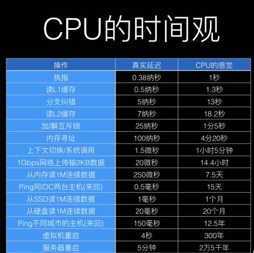
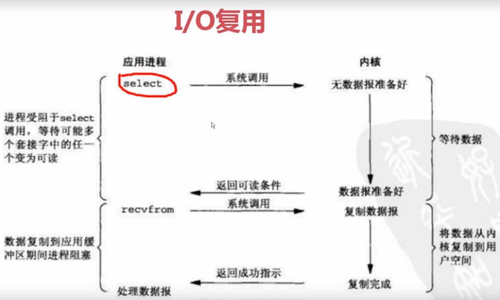
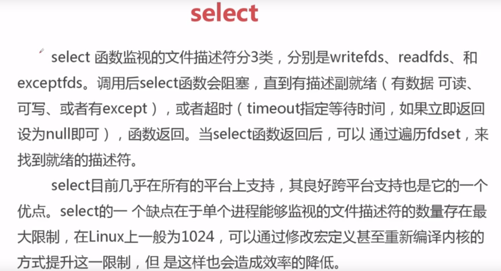

<!-- START doctoc generated TOC please keep comment here to allow auto update -->
<!-- DON'T EDIT THIS SECTION, INSTEAD RE-RUN doctoc TO UPDATE -->
**Table of Contents**  *generated with [DocToc](https://github.com/thlorenz/doctoc)*

- [c10k 1GHz CPU 2G内存，1gbps，让单台服务器同时为1万个客户端提供FTP服务](#c10k-1ghz-cpu-2g%E5%86%85%E5%AD%981gbps%E8%AE%A9%E5%8D%95%E5%8F%B0%E6%9C%8D%E5%8A%A1%E5%99%A8%E5%90%8C%E6%97%B6%E4%B8%BA1%E4%B8%87%E4%B8%AA%E5%AE%A2%E6%88%B7%E7%AB%AF%E6%8F%90%E4%BE%9Bftp%E6%9C%8D%E5%8A%A1)
  - [Unix下五种I/O模型](#unix%E4%B8%8B%E4%BA%94%E7%A7%8Dio%E6%A8%A1%E5%9E%8B)
    - [io多路复用：select 阻塞](#io%E5%A4%9A%E8%B7%AF%E5%A4%8D%E7%94%A8select-%E9%98%BB%E5%A1%9E)
  - [结论](#%E7%BB%93%E8%AE%BA)

<!-- END doctoc generated TOC please keep comment here to allow auto update -->

# c10k 1GHz CPU 2G内存，1gbps，让单台服务器同时为1万个客户端提供FTP服务

CPU告诉我们，它自己很快，而上下文切换慢、内存读数据慢、磁盘寻址与取数据慢、网络传输慢……总之，离开CPU 后的一切，除了一级高速缓存，都很慢。
我们观察计算机的组成可以知道，主要由运算器、控制器、存储器、输入设备、输出设备五部分组成。运算器和控制器主要集成在CPU中，
除此之外全是I/O，包括读写内存、读写磁盘、读写网卡全都是I/O。I/O成了最大的瓶颈.从CPU的时间观中可知，网络I/O是最大的I/O瓶颈，除了宕机没有比它更慢的

## Unix下五种I/O模型

1. 阻塞式IO
2. 非阻塞式IO
3. IO多路复用：比较成熟，稳定
4. 信号驱动IO：比较少
5. 异步IO（posix的aio_系列函数）

### io多路复用：select 阻塞

select,poll,epoll都是IO多路复用机制，IO多路复用就是通过一种机制，一个进程可以监听多个描述符，一旦某个描述符就绪，一般是
读就绪或者写就绪，能够通知程序就行相应的读写操作。但select,poll,epoll本质上都是同步IO，因为他们都需要在读写事件就绪后自己
负责进行读写，也就是说整个读写过程是阻塞的，而异步IO则无需自己进行读写，异步IO的实现会负责把数据从内核拷贝到用户空间。

epoll: 采用红黑树的数据结构

## 结论

epoll并不一定比select好

1.在高并发的情况下，连接活跃度不高的情况，epoll比select好     比如网站，连接之后随时可能断开
2.并发性不是很高，连接活跃度比较高，select比epoll好        比如游戏，很少断开

