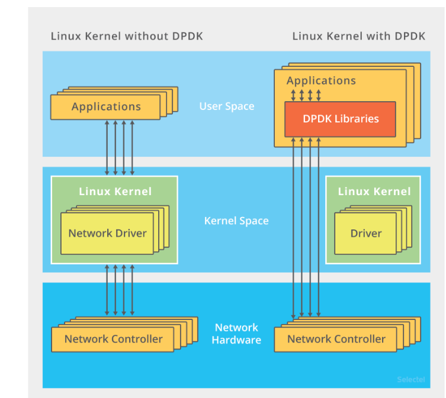
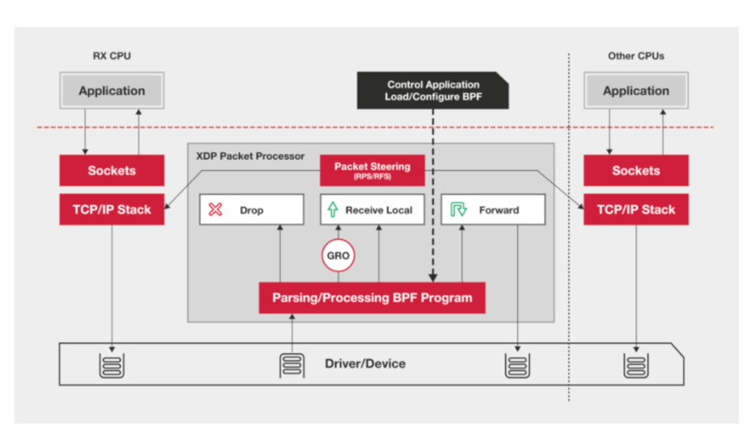

<!-- START doctoc generated TOC please keep comment here to allow auto update -->
<!-- DON'T EDIT THIS SECTION, INSTEAD RE-RUN doctoc TO UPDATE -->
**Table of Contents**  *generated with [DocToc](https://github.com/thlorenz/doctoc)*

- [c10M  如何利用8核心CPU,64GB 内存，在10 gbps网络中保持1000万并发连接](#c10m--%E5%A6%82%E4%BD%95%E5%88%A9%E7%94%A88%E6%A0%B8%E5%BF%83cpu64gb-%E5%86%85%E5%AD%98%E5%9C%A810-gbps%E7%BD%91%E7%BB%9C%E4%B8%AD%E4%BF%9D%E6%8C%811000%E4%B8%87%E5%B9%B6%E5%8F%91%E8%BF%9E%E6%8E%A5)
  - [代码编程问题](#%E4%BB%A3%E7%A0%81%E7%BC%96%E7%A8%8B%E9%97%AE%E9%A2%98)
  - [解决](#%E8%A7%A3%E5%86%B3)

<!-- END doctoc generated TOC please keep comment here to allow auto update -->

# c10M  如何利用8核心CPU,64GB 内存，在10 gbps网络中保持1000万并发连接

首先计算 100 万个请求需要大量的系统资源

- 假设每个请求需要 16KB 内存的话，那么总共就需要大约 15 GB 内存。
- 而从带宽上来说，假设只有 20% 活跃连接，即使每个连接只需要 1KB/s 的吞吐量，总共也需要 1.6 Gb/s 的吞吐量。千兆网卡显然满足不了这么大的吞吐量，所以还需要配置万兆网卡，或者基于多网卡 Bonding 承载更大的吞吐量。

其次，从软件资源上来说，大量的连接也会占用大量的软件资源，比如文件描述符的数量、连接状态的跟踪（CONNTRACK）、网络协议栈的缓存大小（比如套接字读写缓存、TCP 读写缓存）等等。

最后，大量请求带来的中断处理，也会带来非常高的处理成本。这样，就需要多队列网卡、中断负载均衡、CPU 绑定、RPS/RFS（软中断负载均衡到多个 CPU 核上），以及将网络包的处理卸载（Offload）到网络设备（如 TSO/GSO、LRO/GRO、VXLAN OFFLOAD）等各种硬件和软件的优化。

实际上，在 C1000K 问题中，各种软件、硬件的优化很可能都已经做到头了。特别是当升级完硬件（比如足够多的内存、带宽足够大的网卡、更多的网络功能卸载等）后，你可能会发现，无论你怎么优化应用程序和内核中的各种网络参数，想实现 1000 万请求的并发，都是极其困难的。

究其根本，还是 Linux 内核协议栈做了太多太繁重的工作。从网卡中断带来的硬中断处理程序开始，到软中断中的各层网络协议处理，最后再到应用程序，这个路径实在是太长了，就会导致网络包的处理优化，到了一定程度后，就无法更进一步了

C10M 解决方式：

跳过内核协议栈的冗长路径，把网络包直接送到要处理的应用程序那里去。这里有两种常见的机制，DPDK 和 XDP

1. DPDK，是用户态网络的标准。它跳过内核协议栈，直接由用户态进程通过轮询的方式，来处理网络接收



说起轮询，你肯定会下意识认为它是低效的象征，但是进一步反问下自己，它的低效主要体现在哪里呢？是查询时间明显多于实际工作时间的情况下吧！
那么，换个角度来想，如果每时每刻都有新的网络包需要处理，轮询的优势就很明显了

- 在 PPS 非常高的场景中，查询时间比实际工作时间少了很多，绝大部分时间都在处理网络包；

- 而跳过内核协议栈后，就省去了繁杂的硬中断、软中断再到 Linux 网络协议栈逐层处理的过程，应用程序可以针对应用的实际场景，有针对性地优化网络包的处理逻辑，而不需要关注所有的细节


DPDK 还通过大页、CPU 绑定、内存对齐、流水线并发等多种机制，优化网络包的处理效率

2. XDP（eXpress Data Path）


是 Linux 内核提供的一种高性能网络数据路径。它允许网络包，在进入内核协议栈之前，就进行处理，也可以带来更高的性能。
XDP 底层跟我们之前用到的 bcc-tools 一样，都是基于 Linux 内核的 eBPF 机制实现的。


XDP 对内核的要求比较高，需要的是 Linux 4.8 以上版本，并且它也不提供缓存队列。基于 XDP 的应用程序通常是专用的网络应用，常见的有 IDS（入侵检测系统）、DDoS 防御、 cilium 容器网络插件


## [代码编程问题](chapter10_concurent_IO/02_epoll/block.py)
1. 回调模式编码难度高 
2. 同步编程的并发性不高 
3. 多线程编程需要线程间同步,lock

回调之痛：
- do_a()
- do_b()
如果 b 处理依赖于 a 处理的结果，而 a 过程是异步调用，就不知 a 何时能返回值，需要将后续的处理过程以callback的方式传递给 a ，让 a 执行完以后可以执行 b。代码变化为：
do_a(do_b())


## 解决
1. 采用同步的方式去编写异步的代码 
2. 采用单线程去切换任务（线程是有操作系统切换的，单线程切换意味着我们需要程序员自己去调度。
3. 不再需要锁，并发性高，如果单线程内切换函数，性能远高于线程切换，并发性高

协程(Co-routine)，即是协作式的例程。
它是非抢占式的多任务子例程的概括，可以允许有多个入口点在例程中确定的位置来控制程序的暂停与恢复执行。
例程是什么？编程语言定义的可被调用的代码段，为了完成某个特定功能而封装在一起的一系列指令。一般的编程语言都用称为函数或方法的代码结构来体现。

```python


def get_url(url):
    # do something1  费时IO操作
    # 要求：此处暂停，切换到另外一个函数执行
    html = get_html(url)

    # parse html  CPU完成解析
    urls = parse_url(html)

def get_url2():
    pass

# 传统函数调用 A->B->C
# 结论：我们需要一个可以暂停的函数，在必要时候恢复函数的执行，所以出现了协程：有多个路口的函数=可以暂停的函数（可以向暂停的地方传入值）
# 生成器可以暂停

def gen_func():
    # 值会传回到生成器内部
    # 这行代码两个作用：产生值，调用方传入值
    html = yield "http://www.baidu.com"
    print(html)
    yield 2
    yield 3
    return "danny"

# 生成器作用
"""
1. 生成器不仅可以产生值，还可以接收值
"""


if __name__ == "__main__":
    gen = gen_func()
    # 启动生成器的两种方式 send,next
    # 方法一：next
    # print(next(gen))
    # print(next(gen))
    # print(next(gen))

    #方法二 :send

    #模拟download
    # 第一次只能是next,不能send 值，会报错: cannot send non-None Value to a just-started gennerator,刚开始没有执行到yield那行代码
    # 所以 再调用send 发送一个非none值之前，哦们必须启动一次生成器，方式有两种
    # 第一次需要send None ，启动方法一
    url = gen.send(None)
    # 启动方法二
    # url = next(gen)

    print(url)
    html = "input danny"
    # send方法传入值到生成器内部，同时还可以重启生成器到下一个yield位置
    print(gen.send(html))
```