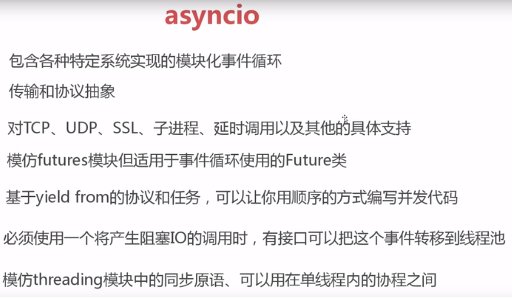

<!-- START doctoc generated TOC please keep comment here to allow auto update -->
<!-- DON'T EDIT THIS SECTION, INSTEAD RE-RUN doctoc TO UPDATE -->
**Table of Contents**  *generated with [DocToc](https://github.com/thlorenz/doctoc)*

- [asyncio模块](#asyncio%E6%A8%A1%E5%9D%97)
  - [基本概念](#%E5%9F%BA%E6%9C%AC%E6%A6%82%E5%BF%B5)
  - [协程嵌套 coroutine_nest](#%E5%8D%8F%E7%A8%8B%E5%B5%8C%E5%A5%97-coroutine_nest)
  - [参考资料](#%E5%8F%82%E8%80%83%E8%B5%84%E6%96%99)

<!-- END doctoc generated TOC please keep comment here to allow auto update -->

# asyncio模块



asyncio 提供的框架以一个事件循环（event loop）为中心，这是一个首类对象，负责高效地处理I / O 事件、系统事件、和应用上下文切换。

## 基本概念

- coroutine 对象（协程对象）：调用一个使用 async def 定义的函数会返回一个协程对象，协程对象无法直接执行，需要将其注册到事件循环中，由事件循环调用
- Future 对象（未来对象）：在 asyncio 中，如何才能得到异步调用的结果呢？先设计一个对象，异步调用执行完的时候，就把结果放在它里面，这种对象称之为未来对象。未来对象有一个 result 方法，可以获取未来对象的内部结果。还有个 set_result 方法，是用于设置 result 的。set_result 设置的是什么，调用 result 得到的就是什么。Future 对象可以看作下面的 Task 对象的容器
- Task 对象（任务）：一个协程就是一个原生可以挂起的函数，任务则是对象协程的进一步封装，里面可以包含协程在执行时的各种状态，关于 Task 和 Future 两者之前的关系我们后面会说。
- event loop（事件循环）：程序开启一个无限循环，可以把一些协程注册到事件循环中，当满足事件发生的时候，就会执行相应的协程。
- async / await 关键字：Python 3.5 开始引入的用于定义协程函数的关键字，async def 定义一个协程函数，调用协程函数会创建协程对象；在一个协程中可以驱动另一个协程，而驱动的方式就是使用 await 关键字。


```python
import asyncio

@asyncio.coroutine
def worker():
    print("worker....")
    res = yield from consumer()
    print(res)


@asyncio.coroutine
def consumer():
    return "i am consumer"


asyncio.run(worker())
"""
worker....
i am consumer
"""
```
使用生成器依旧可以达到这样的效果，然而尽管使用生成器可以达到同样的效果，但还是推荐使用 async 和 await，原因如下：

- 生成器既可以做生成器，又可以包装为协程，那么它到底是协程还是生成器呢？这会使得代码出现混乱
- 生成器既然叫生成器，那么就应该做自己
- 基于async的原生协程比使用yield装饰器的协程要快，大概快10-20%


## [协程嵌套 coroutine_nest](04_coroutine_nest.py)

时序图 


## 参考资料
- [asyncio模块的演变及高级用法](https://zhuanlan.zhihu.com/p/373340063)