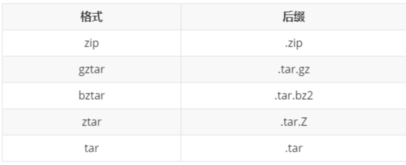

# 包管理


## 背景

在使用Python语言时，通过pip（pip3）来安装第三方包，但是由于pip的特性，系统中只能安装每个包的一个版本。但是在实际项目开发中，
不同项目可能需要第三方包的不同版本，迫使我们需要根据实际需求不断进行更新或卸载相应的包，而如果我们直接使用本地的Python环境，
会导致整体的开发环境相当混乱而不易管理，这时候我们就需要开辟一个独立干净的空间进行开发和部署，虚拟环境就孕育而生

```shell
----- 先离线下载包，可以指定包或者文件
$ pip download -d /opt/pip/tmp ansible
$ pip download -d /opt/pip/tmp -r requirement.txt

----- 安装
$ pip install --no-index --find-links="/opt/pip/tmp" ansible
$ pip install --no-index --find-links="/opt/pip/tmp" -r requirements.txt
```

## Python Wheels
.whl文件(WHL file)也称为轮子(wheel)，这是用于python分发(distribution)的标准内置包格式(standard built-package format)。
它包含安装所需的所有文件和元数据(metadata)。.whl文件使用zip进行压缩。.whl文件还包含有关此wheel文件支持的Python版本和平台的信息

### . wheel的类型

(1).universal wheel：包含py2.py3-none-any.whl。它在任何操作系统和平台上都支持Python 2和Python 3。

(2).pure-python wheel：包含py3-none-any.whl或py2-none-any.whl。它支持Python 3或Python 2，但不能同时支持两者。它在其它方面与universal wheel相同，但它会被标记为py2或py3而不是py2.py3标签。

(3).platform wheel：支持特定的Python版本和平台。

### Wheel 包 命名格式

```shell
{distribution}-{version}(-{build tag})?-{python tag}-{abi tag}-{platform tag}.whl
```

- distribution 为包名称，可以使用下划线
- version 对应了版本号
- python tag 标识具体 Python 的实现，有如下几种：
    - py 只依赖 Python 语言，一般是 py2.py3 ，也就是兼容；或者 py2、py3 只兼容特定版本。
    - cp CPython 通常使用的实现，大多数平台，使用最广泛。
    - ip IronPython 跑在 Windows CLI 平台上的 Python 实现。
    - pp PyPy 带 JIT 的 Python 实现。
    - jy Jython 跑在 JVM 上的 Python 实现。
- abi tag 为 ABI 标签，如 cp27mu
- platform tag 为平台信息，例 linux_aarch64、linux_x86_64 等

example
```shell
cryptography-2.9.2-cp35-abi3-macosx_10_9_x86_64.whl
```
- cryptography 包名
- 2.9.2  版本
- cp35 代表 cpython 3.5

```shell
$ python -m pip install 'uwsgi==2.0.*'
 2 Collecting uwsgi==2.0.*
 3   Downloading uwsgi-2.0.18.tar.gz (801 kB)
 4      |████████████████████████████████| 801 kB 1.1 MB/s
 5 Building wheels for collected packages: uwsgi
 6   Building wheel for uwsgi (setup.py) ... done
 7   Created wheel for uwsgi ... uWSGI-2.0.18-cp38-cp38-macosx_10_15_x86_64.whl
 8   Stored in directory: /private/var/folders/jc/8_hqsz0x1tdbp05 ...
 9 Successfully built uwsgi
10 Installing collected packages: uwsgi
11 Successfully installed uwsgi-2.0.18
```

- 在第3行，它下载一个名为uwsgi-2.0.18.tar.gz的TAR文件(tarball)，该文件是用gzip压缩的。
- 在第6行，它接受tarball并通过调用setup.py构建一个.whl文件。
- 在第7行，它将轮子标记为uWSGI-2.0.18-cp38-cp38-macosx_10_15_x86_64.whl。
- 在第10行，它在构建了轮子之后安装实际的包。

pip检索的tar.gz tarball是一个源分发包，或sdist，而不是一个轮子。

源代码发行版包含源代码。这不仅包括Python代码，还包括与包绑定的任何扩展模块的源代码(通常用C或c++编写)。

源分发版还包含一个元数据包，位于名为.egg-info的目录中。该元数据有助于构建和安装包，但用户实际上并不需要使用它做任何事情

```shell
$ python -m pip install 'chardet==3.*'
 2 Collecting chardet
 3   Downloading chardet-3.0.4-py2.py3-none-any.whl (133 kB)
 4      |████████████████████████████████| 133 kB 1.5 MB/s
 5 Installing collected packages: chardet
 6 Successfully installed chardet-3.0.4
```

安装chardet时直接从PyPI下载一个.whl文件。车轮名称为chardet-3.0.4-py2.py3-none-any。


在上面，您看到了获取预构建轮子的安装和下载sdist的安装的比较。轮子使得Python包的端到端安装速度更快，原因有两个:

- 在其他条件相同的情况下，轮子通常比源分发包更小，这意味着它们可以在网络中更快地移动。

- 直接从wheels安装避免了从源分发版构建包的中间步骤。

## 打包工具


### 包分发的始祖：distutils

distutils 是 Python 的一个标准库，从命名上很容易看出它是一个分发（distribute）工具（utlis），它是 Python 官方开发的一个分发打包工具，所有后续的打包工具，全部都是基于它进行开发的。


### 分发工具升级：setuptools


setuptools是Python distutils增强版的集合，它可以帮助我们更简单的创建和分发Python包，尤其是拥有依赖关系的。
用户在使用setuptools创建的包时，并不需要已安装setuptools，只要一个启动模块即可

setuptools管理Python的第三方包，将包安装到site-package下，安装的包后缀一般为.egg，实际为ZIP格式。


### 源码包与二进制包什么区别？

Python 包的分发可以分为两种：

1. 以源码包的方式发布

源码包安装的过程，是先解压，再编译，最后才安装，所以它是跨平台的，由于每次安装都要进行编译，相对二进制安装方式来说安装速度较慢。

源码包的本质是一个压缩包，其常见的格式



2. 以二进制包形式发布


二进制包的安装过程省去了编译的过程，直接进行解压安装，所以安装速度较源码包来说更快。

由于不同平台的编译出来的包无法通用，所以在发布时，需事先编译好多个平台的包。
 
二进制包的常见格式有: 


有时候需要离线安装包，可以直接从仓库下载二进制文件即可，也可以省去编译过程。从仓库下载对应的 XXX.whl 安装包，并通过 pip install XXX.whl 即可。
另外，如果发现有 XXX.egg 文件，那么可以通过 easy_install XXX.egg 命令安装

### eggs 与 wheels 有什么区别？

Egg 格式是由 setuptools 在 2004 年引入，而 Wheel 格式是由 PEP427 在 2012 年定义。Wheel 的出现是为了替代 Egg，它的本质是一个zip包，其现在被认为是 Python 的二进制包的标准格式。


## 虚拟环境管理工具
1. virtualenv ，此工具会在项目目录下创建一个文件夹，名字叫做virtualenv_name，此目录下会包含python拷贝，之后所有的依赖都会保存至此目录中，在虚拟环境激活状态下，可以安装所需的依赖包，安装的依赖包会保存至项目虚拟环境目录virtualenv_name 下，不会污染系统全局环境；

2. virtualenvwrapper ，virtualenvwrapper是对virtualenv接口的封装。virtualenvwrapper会将虚拟环境的目录统一保存，不需手动管理，使用起来更加便利；


## 包管理器的种类

1）pip是最常用的包管理工具，通过pipinstall命令格式安装软件包，使用pypi软件包。

2）作为科学计算领域的包管理工具，conda功能丰富，功能强大，所用软件包源为Anacondarepository和AnacondaCloud，conda不仅支持Python软件包，还可安装C,C++,R和其它语言的二定制软件包。除软件包管理外，还可提供相互隔离的软件环境。

3）Pipenv是KennethReitz于2017年1月发布的Python依赖管理工具，现在由PyPA维护。Pipenv自动管理虚拟环境和依赖文件，提供一系列命令和选项，实现各种依赖和环境管理相关操作。

4）Poetry与Pipenv相似，是Python虚拟环境和依赖管理工具，此外还提供包管理功能，如包装和发布。您可以将其视为Pipenv和Flit工具的超集。使用Poetry可以同时管理Python库和Python程序。


## 1 pip

### pip 缓存
macos 查看缓存
```shell
(advanced_python_code) ➜  advanced_python_code git:(feature/package) ✗ pip cache dir
/Users/python/Library/Caches/pip
```

```shell
# linux
~/.cache/pip # and it respects the XDG_CACHE_HOME directory.

```


### 指定全局安装源

在 *nix 和 MacOS 中，配置文件为 $HOME/.pip/pip.conf ，对于 Windows 保存在 C:\Users\<USRNAME>\pip\pip.ini 文件中，一般的内容如下。

```text
[global]
timeout = 6000
index-url = https://pypi.douban.com/simple

```
常用的源有：

- 豆瓣 https://pypi.douban.com/simple
- 中国科学技术大学 https://mirrors.ustc.edu.cn/pypi/web/simple/
- 清华大学TUNA https://pypi.tuna.tsinghua.edu.cn/simple

## 2 conda


## 3 pipenv
pipenv 是 Pipfile 主要倡导者、requests 作者 Kenneth Reitz 写的一个命令行工具，
主要包含了Pipfile、pip、click、requests和virtualenv，能够有效管理Python多个环境，各种第三方包及模块

### 优势
1. pipenv会在项目目录下创建Pipfile和Pipfile.lock文件，可以更好的管理包之间的依赖关系，以前我们需要将虚拟环境依赖包的导出为requirements.txt, 
一旦依赖包变动,就要重新导出，现在Pipfile和Pipfile.lock文件可以节省这些步骤，更方便地管理；

2. 便于docker容器化管理，Pipfile文件支持生成requirements文件，便于项目代码docker化管理，另外，pipfile还支持--dev环境，可以在调试阶段安装许多调试工具等，而不影响生产环境的环境。

3. pipenv集成了pip，virtualenv两者的功能，且完善了两者的一些缺陷。


### 使用

可使用的命令参数 及 选项
```shell
$ pipenv
Usage: pipenv [OPTIONS] COMMAND [ARGS]...

Options:
  --update         更新Pipenv & pip
  --where          显示项目文件所在路径
  --venv           显示虚拟环境实际文件所在路径
  --py             显示虚拟环境Python解释器所在路径
  --envs           显示虚拟环境的选项变量
  --rm             删除虚拟环境
  --bare           最小化输出
  --completion     完整输出
  --man            显示帮助页面
  --three / --two  使用Python 3/2创建虚拟环境（注意本机已安装的Python版本）
  --python TEXT    指定某个Python版本作为虚拟环境的安装源
  --site-packages  附带安装原Python解释器中的第三方库
  --jumbotron      不知道啥玩意....
  --version        版本信息
  -h, --help       帮助信息
  
Commands:
  check      检查安全漏洞
  graph      显示当前依赖关系图信息
  install    安装虚拟环境或者第三方库
  lock       锁定并生成Pipfile.lock文件
  open       在编辑器中查看一个库
  run        在虚拟环境中运行命令
  shell      进入虚拟环境
  uninstall  卸载一个库
  update     卸载当前所有的包，并安装它们的最新版本
```

#### 从现有项目创建虚拟环境
对于现有项目，可以区分为三种情况：

1. 没有使用 pipenv
使用 pipenv install -r path/to/requirements.txt --python 3.6 来安装依赖。

2. 有使用意向，但需要兼容旧方式
通过 pipenv lock -r > requirements.txt 生成与 pip 相同格式的依赖管理文件。

3. 已经在使用
根据需要可以使用 pipenv install 或 pipenv sync。两者都会根据 Pipfile 中的 Python 版本创建虚拟环境，使用指定的 PyPI 源，区别是 pipenv install 会根据 Pipfile 中的版本信息安装依赖包，并重新生成 Pipfile.lock；而 pipenv sync 会根据 Pipfile.lock 中的版本信息安装依赖包

4. 会初始化在你的项目根目录下生成pipfile文件

[pipfile](Pipfile)
[Pipfile.lock](Pipfile.lock)

在packages下填入的库和版本是可以用于生产环境和生成requirements文件的，在dev-packages下的则可以安装一下调试工具、性能测试工具、python语法工具等

运行项目
```shell
pipenv run python chapter01__all_is_obj/01_all_is_object.py
```


#### 缺点
由于需要根据依赖关系以及文件 hash 来生成 Pipfile.lock，所以短时间内看这个问题应该是无法解决的。需要在 pipenv 带来的依赖管理功能与速度上做一个权衡取舍

目前的办法是在安装依赖时使用 pipenv install --skip-lock 来跳过生成/更新 Pipfile.lock,然后在需要时执行 pipenv lock 来生成/更新 Pipfile.lock

## 4. poetry

Poetry 是Python 中的依赖管理和打包工具，当然它也可以配置虚拟环境。


### 使用
初始化项目
```shell
poetry init
```


## 参考链接

1. [python wheels](https://realpython.com/python-wheels/)
2. [pip cache](https://stackoverflow.com/questions/9510474/pip-uses-incorrect-cached-package-version-instead-of-the-user-specified-version)
3. [pipenv issue](https://github.com/pypa/pipenv/issues/1914)