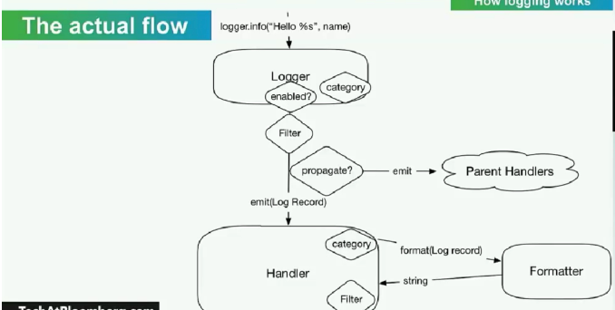

# 日志

整个日志记录的框架可以分为这么几个部分：

- Logger：即 Logger Main Class，是我们进行日志记录时创建的对象，我们可以调用它的方法传入日志模板和信息，来生成一条条日志记录，称作 Log Record。
- Log Record：就代指生成的一条条日志记录。
- Handler：即用来处理日志记录的类，它可以将 Log Record 输出到我们指定的日志位置和存储形式等，如我们可以指定将日志通过 FTP 协议记录到远程的服务器上，Handler 就会帮我们完成这些事情。
- Formatter：实际上生成的 Log Record 也是一个个对象，那么我们想要把它们保存成一条条我们想要的日志文本的话，就需要有一个格式化的过程，那么这个过程就由 Formatter 来完成，返回的就是日志字符串，然后传回给 Handler 来处理。
- Filter：另外保存日志的时候我们可能不需要全部保存，我们可能只需要保存我们想要的部分就可以了，所以保存前还需要进行一下过滤，留下我们想要的日志，如只保存某个级别的日志，或只保存包含某个关键字的日志等，那么这个过滤过程就交给 Filter 来完成。
- Parent Handler：Handler 之间可以存在分层关系，以使得不同 Handler 之间共享相同功能的代码。

## handler 

logging 模块提供的 Handler

- StreamHandler：logging.StreamHandler；日志输出到流，可以是 sys.stderr，sys.stdout 或者文件。
- FileHandler：logging.FileHandler；日志输出到文件。
- BaseRotatingHandler：logging.handlers.BaseRotatingHandler；基本的日志回滚方式。
- RotatingHandler：logging.handlers.RotatingHandler；日志回滚方式，支持日志文件最大数量和日志文件回滚。
- TimeRotatingHandler：logging.handlers.TimeRotatingHandler；日志回滚方式，在一定时间区域内回滚日志文件。
- SocketHandler：logging.handlers.SocketHandler；远程输出日志到TCP/IP sockets。
- DatagramHandler：logging.handlers.DatagramHandler；远程输出日志到UDP sockets。
- SMTPHandler：logging.handlers.SMTPHandler；远程输出日志到邮件地址。
- SysLogHandler：logging.handlers.SysLogHandler；日志输出到syslog。
- NTEventLogHandler：logging.handlers.NTEventLogHandler；远程输出日志到Windows NT/2000/XP的事件日志。
- MemoryHandler：logging.handlers.MemoryHandler；日志输出到内存中的指定buffer。
- HTTPHandler：logging.handlers.HTTPHandler；通过"GET"或者"POST"远程输出到HTTP服务器。

## 参考资料
1 [PyCon 2018: 利用logging模块轻松地进行Python日志记录](https://juejin.cn/post/6844903616046694413)
