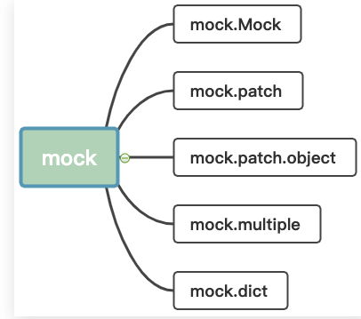
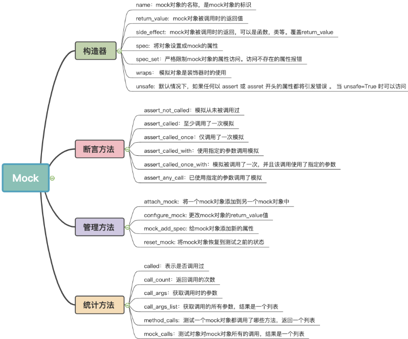

<!-- START doctoc generated TOC please keep comment here to allow auto update -->
<!-- DON'T EDIT THIS SECTION, INSTEAD RE-RUN doctoc TO UPDATE -->
**Table of Contents**  *generated with [DocToc](https://github.com/thlorenz/doctoc)*

- [unitest](#unitest)
  - [流程](#%E6%B5%81%E7%A8%8B)
  - [基本概念](#%E5%9F%BA%E6%9C%AC%E6%A6%82%E5%BF%B5)
  - [mock](#mock)
    - [Mock类](#mock%E7%B1%BB)
    - [mock 常用方法](#mock-%E5%B8%B8%E7%94%A8%E6%96%B9%E6%B3%95)
    - [patch](#patch)
      - [patch.object](#patchobject)
      - [patch.dict](#patchdict)
      - [patch的start和stop方法](#patch%E7%9A%84start%E5%92%8Cstop%E6%96%B9%E6%B3%95)
  - [参考](#%E5%8F%82%E8%80%83)

<!-- END doctoc generated TOC please keep comment here to allow auto update -->


# unitest

unittest是Python标准库中自带的单元测试框架，unittest有时候也被称为PyUnit

unittest是一个单元测试的框架,能够提供很多测试相关的功能，如：编写测试用例，准备测试环境，生成测试报告等。unittest 中集成了mock，可以用来模拟一些函数返回，未实现的接口等。

## 流程
一个基本的单元测试通常包含以下几个部分：

1. 导入unittest模块。
2. 定义一个继承自unittest.TestCase的测试类。
3. 在这个测试类中定义各种测试方法（方法名以test_开头）。
4. 在这些测试方法中使用unittest.TestCase的各种断言方法来检查被测代码的行为。


## 基本概念

在unittest模块中，我们有以下几个重要的概念：

- 测试用例（Test Case）：一个测试用例就是一个完整的测试流程，包括测试前的准备环节、执行测试动作和测试后的清扫环节。在unittest模块中，一个测试用例就是一个unittest.TestCase的实例。
- 测试套件（Test Suite）：测试套件是一系列的测试用例或测试套件的集合。我们可以使用unittest.TestSuite类来创建测试套件。
- 测试运行器（Test Runner）：测试运行器是用来执行和控制测试的。我们可以使用unittest.TextTestRunner类来创建一个简单的文本测试运行器。


## mock 


python3.3 以前，mock是第三方库，需要安装之后才能使用。python3.3之后，mock作为标准库内置到 unittest。

### Mock类

最常用的就是Mock和MagicMock，可以用来模拟对象、属性和方法，并且会保存这些被模拟的对象的使用细节，之后再使用断言来判断它们是否按照期待的被使用。


MagicMock类，它继承自Mock并实现了所有常用的magic方法。


Mock对象是模拟的基石，提供了丰富多彩的功能。从测试的阶段来分类包括：


- 构造器：创建mock对象
- 断言方法：判断代码运行的状态
- 管理方法：管理mock对象
- 统计方法：统计mock对象的调用

```python
class Mock(CallableMixin, NonCallableMock):

class CallableMixin(Base):

    def __init__(self, spec=None, side_effect=None, return_value=DEFAULT,
                 wraps=None, name=None, spec_set=None, parent=None,
                 _spec_state=None, _new_name='', _new_parent=None, **kwargs):


class NonCallableMock(Base):
    """A non-callable version of `Mock`"""

    def __init__(
            self, spec=None, wraps=None, name=None, spec_set=None,
            parent=None, _spec_state=None, _new_name='', _new_parent=None,
            _spec_as_instance=False, _eat_self=None, unsafe=False, **kwargs
        ):
```
参数
* spec： 可以传入一个字符串列表、类或者实例，如果传入的是类或者实例对象，那么将会使用 dir 方法将该类或实例转化为一个字符串列表（magic属性和方法除外）。访问（get操作）任何不在此列表中的属性和方法时都会抛出AttributeError。如果传入的是一个类或者实例对象，那么__class__方法会返回对应的类，以便在使用 isinstance 方法时进行判断。
* spec_set： spec参数的变体，但更加严格，如果试图使用get操作或set操作来操作此参数指定的对象中没有的属性或方法，则会抛出AttributeError。spec参数是可以对spec指定对象中没有的属性进行set操作的。参考 mock_add_spec 方法。
* side_effect： 可以传入一个函数，每次当Mock对象被调用的时候，就会自动调用该函数，可以用于抛出异常或者动态改变mock对象的返回值，此函数使用的参数与mock对象被调用时传入的参数是一样的，并且，除非它的返回值为 unittest.mock.DEFAULT 对象，否则这个函数的返回值将会作为mock对象的返回值。也可以传入一个exception对象或者实例对象，如果传入exception对象，则每次调用mock对象都会抛出该异常。也可以传入一个可迭代对象，每次调用mock对象时就会返回该迭代对象的下一个值。如果不想使用了，可以将它设置为None。具体参见后面mock对象 side_effect 属性的使用。
* return_value： 每次调用mock对象时的返回值，默认第一次调用时创建新的Mock对象


### mock 常用方法
assert_called()：mock对象至少被调用过一次。（Python3.6新增）

assert_called_once()：mock对象只被调用过一次。（Python3.6新增）

assert_called_with(*args, **kwargs)：mock对象最后一次被调用的方式。

mock_add_spec(spec, spec_set=False):spec参数可以是一个对象或者一个字符串列表，如果指定了此参数，那么只有spec指定的属性才可以进行访问（get操作）。如果spec_set设置为True，那么只有spec中指定的属性才可以进行set操作。

return_value：指定mock对象被调用时的返回值，也可以在创建mock对象时通过参数进行指定。如果没有进行指定，return_value的默认值为一个mock对象，而且它就是一个正常的mock对象，你可以把它当成普通的mock对象进行其他操作。


side_effect: 这个属性可以是函数、可迭代对象或者异常（类或实例都可以），当mock对象被调用时， side_effect 属性对应的对象就会被调用一次。
如果传入的是函数，那么它将在mock对象调用时被执行，且执行时此函数传入的参数与mock对象被调用时的参数是一致的，此函数的返回值即mock被对象调用的返回值，但是如果函数的返回值是 unittest.mock.DEFAULT 对象，那么mock对象被调用的返回值就是它自身的return_value属性值。
如果传入的是一个可迭代对象，那么这个对象将被用作产生一个迭代器，这个迭代器在每一次mock对象被调用时返回一个值，这个值可以是异常类的实例，也可以是一个普通的值，当然如果这个返回值是一个 unittest.mock.DEFAULT 对象，则返回mock对象本身的return_value属性值。

### patch 

mock.Mock的不足之处
Mock方法是最基础的方法，在使用的使用需要实例化一个对象，设置方法，然后完成模拟。这里有一个问题：没有控制mock范围，控制不精细。

为此，mock中还提供了 mock.patch和mock.patch.object 等多个对象。mock.patch 是一种进阶的使用方法，主要是方便函数和类的测试，有三种使用方法：

- 函数修饰器
- 类修饰器
- 上下文管理器

patch有三种使用方法，最佳的使用实践是装饰器形态

patch 可以用装饰器的方式对属性、方法和类进行装饰，或者在with上下文中使用，或者使用start和stop方法直接在代码中使用。
使用patch的目的是在代码运行时将指定的对象变为执行mock对象，并且是在单元测试开始时就可以指定所有的mock对象，非常方便

```python
# 只能导入到模块（文件和包）这一级，不能直接导入类
# 这里的unittest_mock包下有一个test文件，本示例中对应的类都定义在这个文件中
import unittest_mock.test


# patch使用时传入对应类的路径字符串
@patch('unittest_mock.test.PatchTest2')
@patch('unittest_mock.test.PatchTest1')
def patch_test(MockTest1, MockTest2):  # 注意这里的传参顺序是按照装饰的顺序（从下到上）来指定的
    unittest_mock.test.PatchTest1()  # 这里执行的已经不是真实的类了，而是一个MagicMock类
    unittest_mock.test.PatchTest2()
    assert MockTest1 is unittest_mock.test.PatchTest1  # 这里表明传入的参数和对应的类是相同的，都是MagicMock类
    assert MockTest2 is unittest_mock.test.PatchTest2
    assert MockTest1.called  # 表明这个类在这之前已经被调用了
    assert MockTest2.called


if __name__ == '__main__':
    patch_test()

```

```python
def patch(
        target, new=DEFAULT, spec=None, create=False,
        spec_set=None, autospec=None, new_callable=None, **kwargs
    )
```

- target: 必须是一个str,格式为 package.module.ClassName ，注意这里的格式一定要写对，如果你的函数或类写在pakege名称为a下，b.py脚本里，有个c的函数（或类），那这个参数就写“a.b.c”
- new：如果没有指定，则对于async函数会创建一个AsyncMock对象，对于其他的，则会创建一个MagicMock对象。如果 patch() 是作为一个装饰器，且new参数没有指定，则创建的mock对象将会作为一个额外（即放在被装饰函数原有的参数之后）的参数传入被装饰的函数。如果 patch() 用在上下文管理器中，则创建的mock对象会被上下文管理器返回。


#### patch.object


patch.object用来给对象（target参数）的成员（attribute参数）进行“mock”，其参数的用法和patch是一样的，且也可以使用参数的形式给创建的mock对象添加额外的属性。
如果被装饰的对象是类的话，可以使用 patch.TEST_PREFIX 指定哪些方法需要被“mock”


####  patch.dict
patch.dict 用来“mock”一个字典对象或者类似字典的对象，int_dict参数为需要“mock”的字典对象，也可以是一个可以通过import生成字典对象的字符串


####  patch的start和stop方法
如果不想使用装饰器或with语法而直接使用patch，那么可以使用patch的start方法和stop方法。start方法能直接返回对应的mock对象，而stop方法则是取消使用patch，类似with语句的开始和结束。


## 参考

- [unittest.mock 官方文档](https://docs.python.org/3/library/unittest.mock.html)
- 
